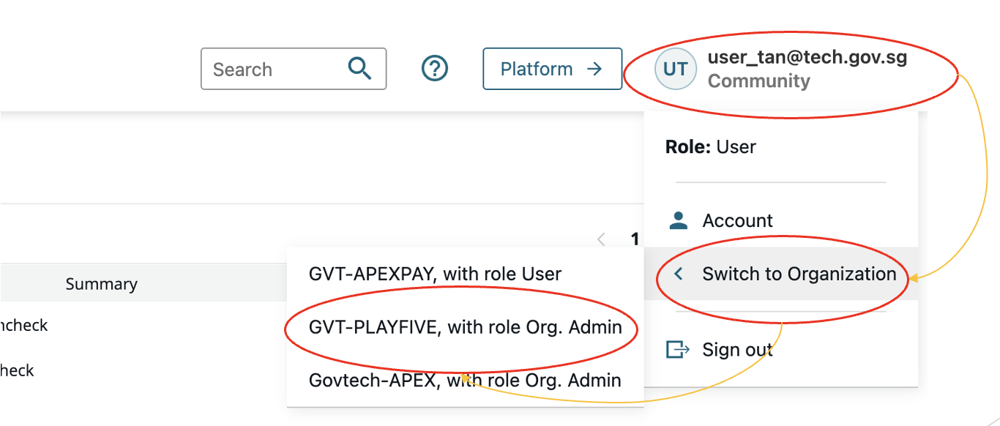
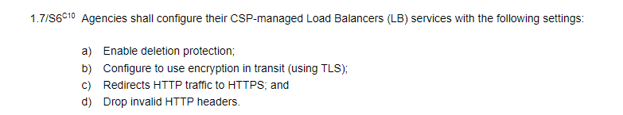

# Common Issues in the API Manager Portal

In this section, you will find a list of common issues that mighe be encountered in the API Manager Portal and the corresponding steps to resolve each issue. 

?> Note: You can use the right sidebar to navigate through the list of common issues.

<!-- 
- [I cannot find any APIs/APPs](#no-apps)
- [Issue 2: ]

Cannot find APIs/APPs
How to request access to API
I am not able to edit the API
I noticed that my customized headers are missing after calling APEX Cloud

 I cannot find any APIs/APPs

<b>
Solution</b>

Please ensure that you are managing the APIs or APPs at the correct environment/zone.

- Staging (external): [https://go.gov.sg/apex-stg](https://go.gov.sg/apex-stg)
- Staging (internal): [https://go.gov.sg/apex-int-stg](https://go.gov.sg/apex-int-stg)
- Production (external): [https://go.gov.sg/apex](https://go.gov.sg/apex)
- Production (internal): [https://go.gov.sg/apex-int](https://go.gov.sg/apex-int)

Once logged in to the desired APEX Cloud API Manager Portal, please switch to the correct Organisation to view/manage the APIs or APPs.

 

<b>
As a consumer or developer, how to request API access?</b>

If you are an existing APEX Cloud consumer, you may email the desired API's publisher and request for access to be given to the organisation which needs to access the API.

For new APEX Cloud consumers, please visit the [APEX Cloud Onboarding Guide](https://docs.developer.tech.gov.sg/docs/apex-cloud-onboarding/) for more information.

<b>
As an API publisher, I am not able to edit the API</b>

An API in a published state cannot be modified. We recommend publishers to create a new API to upgrade the original API to it. If publishers was to unpublish the API to make any changes to it, this will cause the API to lost the API to APP relationship. This relationship can only be established again with the help of the consumer, without the API to APP linkage being re-establish API calls which requires inbound authentication on APEX Cloud will fail.

Therefore publisher are advice to use the [Update API](docs/publisher/update-api.md) workflow to make any changes to their API.

I noticed that my customized headers are missing after calling APEX Cloud

# I noticed that my customized headers are missing after calling APEX Cloud

API calls to APEX Cloud must conform to the regular expression `[-A-Za-z0-9]+` for any HTTP header names. HTTP Headers with names that do not conform to the expression `[-A-Za-z0-9]+` will be considered as invalid HTTP headers and will be dropped, in accordance to IM8 Cloud Security Section Para 1.7 S6.

You may refer to: [https://intranet.mof.gov.sg/portal/IM/Themes/IT-Management/Cloud/Topics/Cloud-Security.aspx](https://intranet.mof.gov.sg/portal/IM/Themes/IT-Management/Cloud/Topics/Cloud-Security.aspx) for more information.

---

-->

## Unable to find any APIs or Apps

**Issue:**  

I am unable to find APIs or Apps.

**Solution:**

Please ensure that you are managing the APIs or Apps at the correct environment/zone.

- Staging (external): [https://go.gov.sg/apex-stg](https://go.gov.sg/apex-stg)
- Staging (internal): [https://go.gov.sg/apex-int-stg](https://go.gov.sg/apex-int-stg)
- Production (external): [https://go.gov.sg/apex](https://go.gov.sg/apex)
- Production (internal): [https://go.gov.sg/apex-int](https://go.gov.sg/apex-int)

Once logged in to the desired APEX Cloud API Manager Portal, please switch to the correct **Organisation** to view/manage the APIs or Apps.

## Requesting for API access

**Issue:**

As a consumer, how do I request for access to the API?

**Solution:**

If you are an existing APEX Cloud consumer, you can email the API publisher and request for access to be given to the organisation which needs to access the API.

For new APEX Cloud consumers, please visit the [APEX Cloud Onboarding Guide](https://docs.developer.tech.gov.sg/docs/apex-cloud-onboarding/) for more information.

## Unable to edit the API

**Issue:** 

An API in a published state cannot be modified. If publishers were to unpublish the API to make any changes to it, the API will lose the API to App relationship. This relationship can only be established again with the help of the consumer.  Without the API to App linkage being re-established,  API calls, which require inbound authentication on APEX Cloud, will fail.

**Solution:**

 We recommend publishers to create a new API with the needed updates, and then upgrade the original API to the new API version. Publishers can refer to the [Update API](docs/publisher/update-api.md) workflow to make any changes to their API.

## Missing customised headers

**Issue:** 

Customised headers are missing after calling APEX Cloud.

**Solution:**

API calls to APEX Cloud must conform to the regular expression `[-A-Za-z0-9]+` for any HTTP Header names. HTTP Headers with names that do not conform to the expression `[-A-Za-z0-9]+` will be considered as invalid HTTP headers and will be dropped, in accordance to IM8 Cloud Security Section Para 1.7 S6.

You may refer to [the MOF Cloud Security content](https://intranet.mof.gov.sg/portal/IM/Themes/IT-Management/Cloud/Topics/Cloud-Security.aspx) for more information. This is an intranet link.